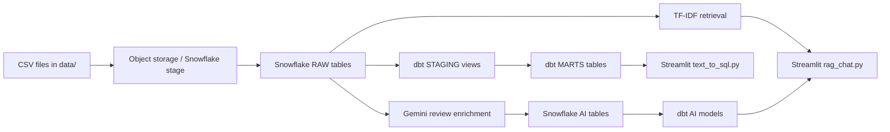
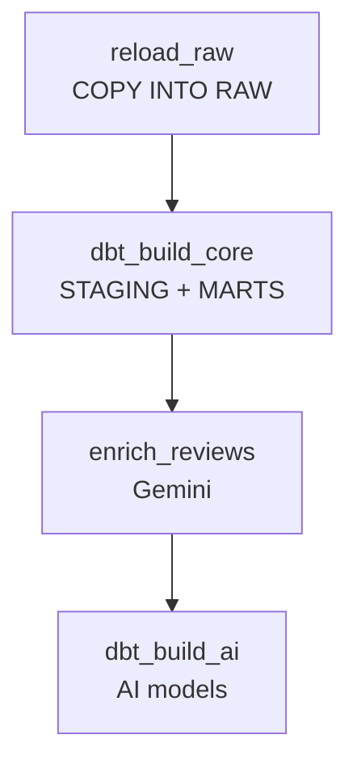

# Food Delivery Data Project

Dự án phân tích dữ liệu giao đồ ăn theo mô hình data pipeline hiện đại với **Snowflake**, **dbt**, **Apache Airflow**, **Gemini** và **Streamlit**.

Pipeline nhận dữ liệu CSV, nạp vào Snowflake, làm sạch và xây dựng các bảng phân tích bằng dbt. Review của khách hàng được Gemini phân loại sentiment/chủ đề, sau đó người dùng có thể hỏi dữ liệu bằng ngôn ngữ tự nhiên qua hai ứng dụng Streamlit.

> Dự án này dùng dữ liệu mẫu theo ngữ cảnh Zomato/food delivery.

## Mục tiêu

- Nạp dữ liệu nhà hàng, người dùng, món ăn, menu, đơn hàng, chi tiết đơn hàng và review vào Snowflake.
- Chuẩn hóa dữ liệu bằng dbt staging models.
- Xây dựng dimension, fact và các bảng mart phục vụ phân tích.
- Tự động hóa pipeline hằng ngày bằng Airflow chạy trên Docker.
- Dùng Gemini để enrich review khách hàng.
- Cho phép hỏi số liệu bằng text-to-SQL và hỏi insight từ review bằng RAG.

## Kiến trúc



### Luồng Airflow hằng ngày



DAG tương ứng là `airflow/dags/zomato_batch.py`, có `schedule="@daily"` và `catchup=False`.

## Cấu trúc repository

```text
.
├── ai/
│   ├── enrich_reviews.py       # Gemini phân loại review và ghi vào ZOMATO.AI
│   ├── rag_chat.py             # Streamlit hỏi đáp dựa trên review liên quan
│   └── text_to_sql.py          # Streamlit chuyển câu hỏi thành SQL Snowflake
├── airflow/
│   ├── dags/zomato_batch.py    # DAG nạp dữ liệu, dbt và AI enrichment
│   ├── docker-compose.yaml     # Airflow 3 + PostgreSQL metadata database
│   └── Dockerfile              # Image Airflow và môi trường dbt
├── data/
│   ├── food.csv
│   ├── menu.csv
│   ├── order_items.csv
│   ├── orders.csv
│   ├── restaurant.csv
│   ├── reviews.csv
│   └── users.csv
├── zomato/
│   ├── dbt_project.yml
│   ├── models/staging/         # Làm sạch và chuẩn hóa nguồn RAW
│   ├── models/marts/           # Fact, dimension, business marts
│   └── target/                 # dbt artifacts, thường không cần commit
├── .gitignore
├── LICENSE
└── README.md
```

## Data model

### Nguồn RAW

Các bảng nguồn được khai báo trong `zomato/models/staging/_sources.yml`:

- `ZOMATO.RAW.RESTAURANTS`
- `ZOMATO.RAW.USERS`
- `ZOMATO.RAW.FOOD`
- `ZOMATO.RAW.MENU`
- `ZOMATO.RAW.ORDERS`
- `ZOMATO.RAW.ORDER_ITEMS`
- `ZOMATO.RAW.REVIEWS`

### STAGING

Các model staging đọc từ RAW và chuẩn hóa kiểu dữ liệu, tên cột, giá trị rỗng và một số trường dẫn xuất:

- `stg_restaurants`
- `stg_users`
- `stg_food`
- `stg_menu`
- `stg_orders`
- `stg_order_items`
- `stg_reviews`

Trong `dbt_project.yml`, staging được materialize thành **view** trong schema `STAGING`.

### MARTS

Các model mart chính gồm:

- `fct_orders`: fact đơn hàng.
- `fact_order_items`: fact chi tiết món trong đơn.
- `dim_customer`: dimension khách hàng.
- `dim_date`: dimension ngày.
- `dim_food`: dimension món ăn.
- `dim_restaurants`: dimension nhà hàng.
- `mart_daily_city_revenune`: doanh thu, số đơn và tỷ lệ hủy theo thành phố/ngày.
- `mart_delivery_sla`: chỉ số thời gian giao hàng.
- `mart_restaurant_performance`: hiệu suất nhà hàng.
- `mart_review_insights`: insight review sau khi enrich bằng Gemini.

Marts được materialize chủ yếu thành **table** trong schema `MARTS`. Hai fact order sử dụng incremental merge theo khóa duy nhất.

## Ứng dụng AI

### Text-to-SQL: `ai/text_to_sql.py`

Ứng dụng Streamlit cho phép hỏi các chỉ số trong Snowflake bằng tiếng Anh. Gemini tạo một câu SQL `SELECT`, ứng dụng kiểm tra câu SQL rồi thực thi trên Snowflake và hiển thị bảng kết quả hoặc biểu đồ.

Ví dụ câu hỏi:

- `Top 10 cities by GMV`
- `Average delivery time by city, worst first`
- `Cancel rate by payment method`

Chạy:

```powershell
cd ai
streamlit run text_to_sql.py
```

Mở `http://localhost:8501`.

### RAG review chat: `ai/rag_chat.py`

Ứng dụng này phục vụ câu hỏi về nội dung review:

1. Đọc một mẫu review từ Snowflake.
2. Dùng TF-IDF để tìm các review liên quan nhất.
3. Gửi câu hỏi và các review liên quan cho Gemini.
4. Hiển thị câu trả lời cùng các review đã được sử dụng.

Chạy:

```powershell
cd ai
streamlit run rag_chat.py
```

### Review enrichment: `ai/enrich_reviews.py`

Script batch đọc review mới từ `ZOMATO.RAW.REVIEWS`, dùng Gemini để tạo:

- `sentiment_label`
- `sentiment_score`
- `topic`
- `key_issue`

Kết quả được ghi vào `ZOMATO.AI.REVIEW_ENRICHED`. Script không xử lý lại review đã tồn tại trong bảng đích.

Chạy thủ công:

```powershell
cd ai
python enrich_reviews.py
```

## Yêu cầu cài đặt

- Python 3.x
- Docker Desktop và Docker Compose
- Tài khoản Snowflake có database/schema/warehouse phù hợp
- API key Gemini
- Các Python packages cần thiết cho ứng dụng AI:

```powershell
pip install streamlit pandas numpy snowflake-connector-python google-genai python-dotenv scikit-learn
```

## Cấu hình biến môi trường

Tạo file `ai/.env` trên máy local hoặc file `.env` phù hợp với cách bạn chạy ứng dụng. Không commit file này.

Ví dụ cấu hình, dùng placeholder thay vì credential thật:

```dotenv
GEMINI_API_KEY=your_gemini_api_key
SNOWFLAKE_ACCOUNT=your_account_identifier
SNOWFLAKE_USER=your_username
SNOWFLAKE_PASSWORD=your_password
SNOWFLAKE_WAREHOUSE=ZOMATO_WH
SNOWFLAKE_DATABASE=ZOMATO
SNOWFLAKE_SCHEMA=RAW
SNOWFLAKE_ROLE=DBT_ROLE
```

Các script AI gọi `load_dotenv()` và đọc các biến trên từ environment.

## Chạy dbt thủ công

Cài adapter Snowflake:

```powershell
pip install "dbt-snowflake==1.8.*"
```

Di chuyển vào project dbt:

```powershell
cd zomato
```

Kiểm tra kết nối:

```powershell
dbt debug --profiles-dir .
```

Build phần core:

```powershell
dbt build --exclude tag:ai --profiles-dir .
```

Build các model AI:

```powershell
dbt build --select tag:ai --profiles-dir .
```

Chạy test:

```powershell
dbt test --profiles-dir .
```

`profiles.yml` cần được cấu hình theo môi trường Snowflake local của bạn. Không đặt password trực tiếp vào file dbt hoặc commit secret vào Git.

## Chạy Airflow bằng Docker

Từ thư mục `airflow/`:

```powershell
cd airflow
docker compose build
docker compose up -d
```

Airflow UI:

```text
http://localhost:8080
```

Thông tin đăng nhập mặc định được tạo trong `docker-compose.yaml`:

```text
Username: admin
Password: admin
```

Trong Airflow, bật DAG `zomato_batch` để chạy thủ công hoặc chờ lịch hằng ngày.

Dừng các container:

```powershell
docker compose down
```

Xem log:

```powershell
docker compose logs -f scheduler
docker compose logs -f dag-processor
```

## Kiểm tra nhanh

Kiểm tra cú pháp Python:

```powershell
python -m py_compile ai/text_to_sql.py
python -m py_compile ai/rag_chat.py
python -m py_compile ai/enrich_reviews.py
```

Kiểm tra Gemini SDK:

```powershell
python -c "from google import genai; print('google.genai import ok')"
```

## Lưu ý cấu hình hiện tại

- `airflow/docker-compose.yaml` hiện còn khai báo `OPENAI_API_KEY`, trong khi các script AI đã dùng `GEMINI_API_KEY`. Khi chạy enrichment trong Docker, cần truyền `GEMINI_API_KEY` vào environment của Airflow.
- `airflow/Dockerfile` hiện cài provider/package cho OpenAI, nhưng mã AI dùng `google-genai`. Image Airflow cần cài `google-genai` trước khi task `enrich_reviews` chạy.
- Snowflake stage `ZOMATO.RAW.ZOMATO_RAW_STAGE` và các bảng RAW phải được tạo trước khi chạy `reload_raw`.
- `COPY INTO` cần trỏ tới đúng vị trí file trong stage. Việc upload CSV lên stage không được thực hiện trong DAG hiện tại.
- Không đưa file `Cred`, `.env`, password, API key hoặc Snowflake secret vào GitHub.
- Các file trong `zomato/target/` là artifact sinh ra bởi dbt; thông thường nên ignore và tạo lại bằng `dbt compile` hoặc `dbt build`.

## Ảnh nên bổ sung cho README

README hiện đã có sơ đồ Mermaid nên không bắt buộc phải chụp ảnh. Nếu muốn tài liệu trực quan hơn, nên chụp các ảnh sau:

1. **Airflow DAG Graph**: màn hình graph của `zomato_batch`, thể hiện bốn task theo thứ tự.
2. **Snowflake data model**: sơ đồ hoặc ảnh các schema `RAW`, `STAGING`, `MARTS`, `AI`.
3. **dbt lineage**: lineage từ `RAW` đến staging, marts và AI models.
4. **Text-to-SQL app**: một câu hỏi, SQL được sinh ra và bảng kết quả.
5. **RAG review app**: câu hỏi, câu trả lời Gemini và danh sách review được truy xuất.
6. **Airflow task logs**: log thành công của `reload_raw`, `enrich_reviews` và `dbt_build_ai`.

Có thể lưu ảnh trong thư mục `docs/images/` rồi chèn vào README bằng cú pháp:

```markdown

```

## Bảo mật

Các credential Snowflake/API key là secret. Nếu credential từng được đưa vào file hoặc commit, hãy:

1. Rotate/revoke credential đó trên Snowflake và Gemini.
2. Xóa secret khỏi file tracked và lịch sử Git nếu đã commit.
3. Dùng `.env` local, Docker secrets hoặc secret manager.
4. Kiểm tra `.gitignore` trước khi push repository.

## License

Xem [LICENSE](LICENSE).
