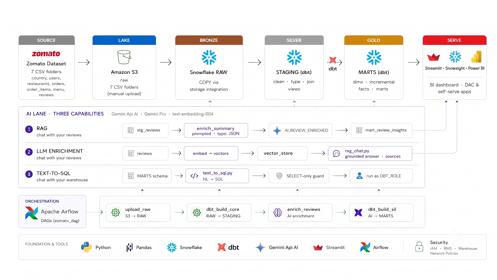
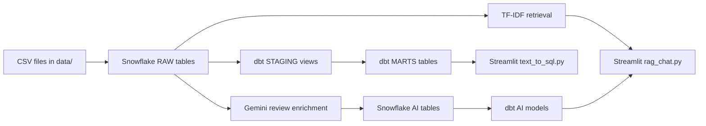
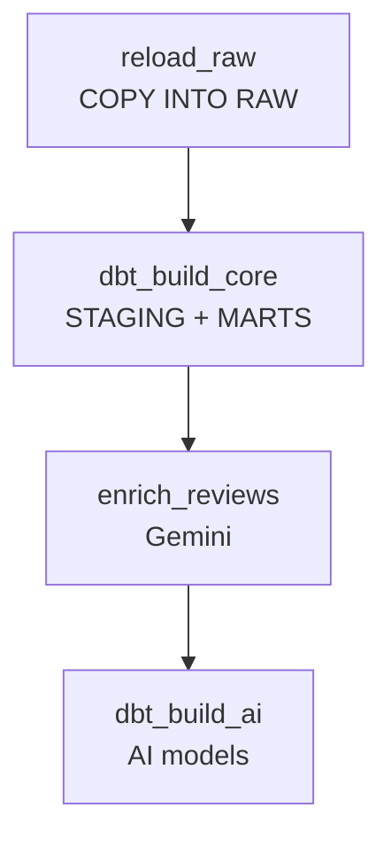
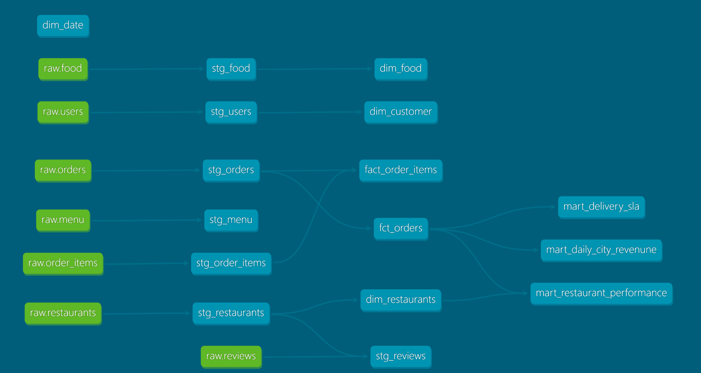
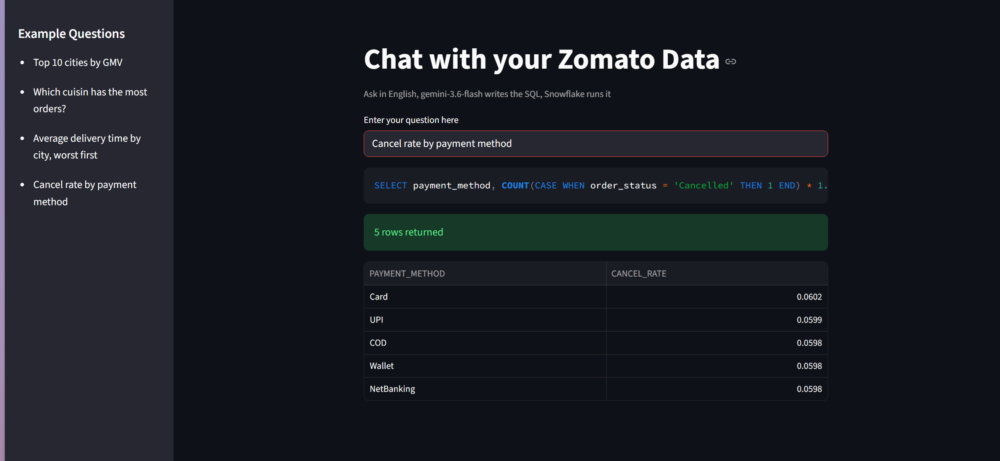
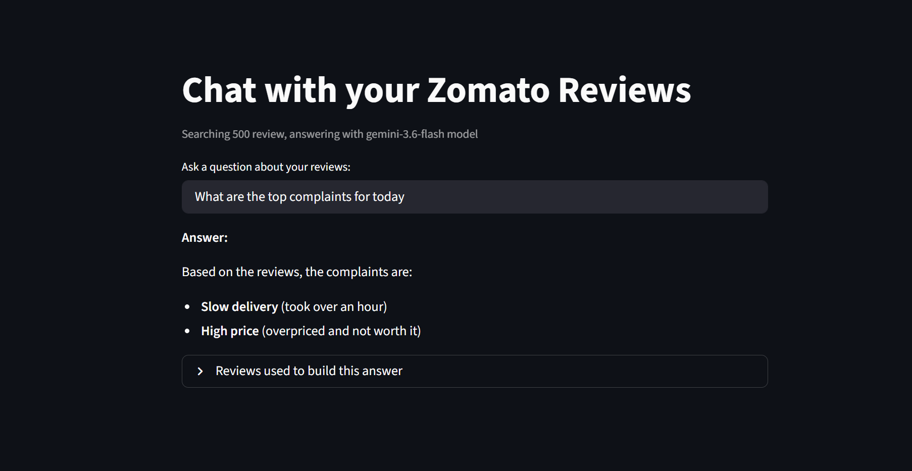
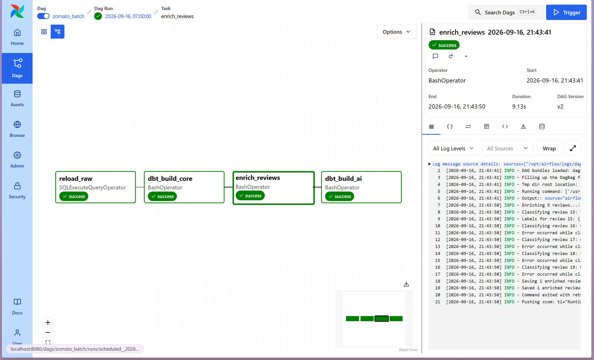
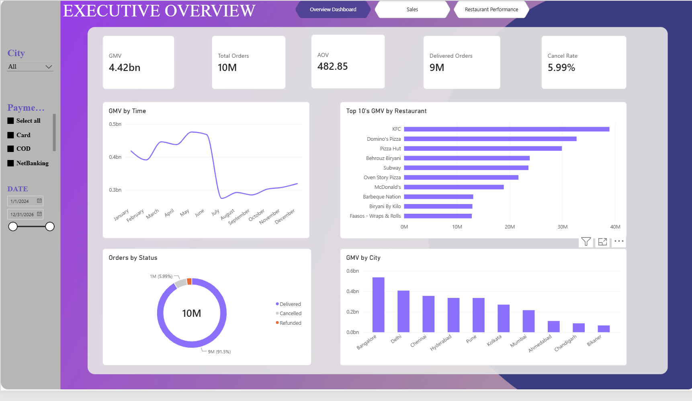

# Food Delivery Data Project

Dự án phân tích dữ liệu giao đồ ăn theo mô hình pipeline dữ liệu hiện đại, tích hợp **Snowflake**, **dbt**, **Apache Airflow**, **Gemini AI** và **Streamlit**. Mục tiêu là biến dữ liệu CSV mẫu thành kho dữ liệu phân tích, từ đó cho phép đặt câu hỏi bằng ngôn ngữ tự nhiên và xem các chỉ số kinh doanh trực quan.

> Dự án này mô phỏng hệ thống dữ liệu cho nền tảng Zomato/food delivery với dữ liệu mẫu thực tế theo mô hình order, restaurant, customer, food và reviews.

## Tổng quan dự án

- Nạp dữ liệu từ các file CSV vào Snowflake.
- Chuẩn hóa dữ liệu bằng dbt model theo tầng staging và marts.
- Tạo pipeline tự động hóa hằng ngày với Airflow.
- Dùng Gemini để enrich review khách hàng (sentiment, topic, key issue).
- Xây dựng 2 ứng dụng AI trên Streamlit:
  - Text-to-SQL: hỏi dữ liệu bằng ngôn ngữ tự nhiên.
  - RAG review chat: trả lời insight từ review khách hàng.
- Kết nối dữ liệu lên dashboard BI bằng Power BI / mart data.

## Kiến trúc hệ thống





### Luồng Airflow hằng ngày



DAG tương ứng là `airflow/dags/zomato_batch.py`, chạy theo lịch `@daily` với `catchup=False`.

## Data model



### Nguồn RAW

Các bảng nguồn trong `zomato/models/staging/_sources.yml`:

- `ZOMATO.RAW.RESTAURANTS`
- `ZOMATO.RAW.USERS`
- `ZOMATO.RAW.FOOD`
- `ZOMATO.RAW.MENU`
- `ZOMATO.RAW.ORDERS`
- `ZOMATO.RAW.ORDER_ITEMS`
- `ZOMATO.RAW.REVIEWS`

### Staging models

Các model tầng staging làm sạch và chuẩn hóa dữ liệu:

- `stg_restaurants`
- `stg_users`
- `stg_food`
- `stg_menu`
- `stg_orders`
- `stg_order_items`
- `stg_reviews`

### Mart models

Các model mart chính bao gồm:

- `fct_orders`: fact đơn hàng
- `fact_order_items`: fact chi tiết món trong đơn
- `dim_customer`: dimension khách hàng
- `dim_date`: dimension ngày
- `dim_food`: dimension món ăn
- `dim_restaurants`: dimension nhà hàng
- `mart_daily_city_revenune`: doanh thu và số đơn theo thành phố/ngày
- `mart_delivery_sla`: thời gian giao hàng
- `mart_restaurant_performance`: hiệu suất nhà hàng
- `mart_review_insights`: insight review sau enrich bằng Gemini

## Cấu trúc repository

```text
.
├── ai/
│   ├── enrich_reviews.py       # Gemini phân loại review và ghi vào ZOMATO.AI
│   ├── rag_chat.py             # Streamlit hỏi đáp theo review liên quan
│   └── text_to_sql.py          # Streamlit chuyển câu hỏi thành SQL Snowflake
├── airflow/
│   ├── dags/zomato_batch.py    # DAG nạp dữ liệu, dbt và AI enrichment
│   ├── docker-compose.yaml     # Airflow 3 + PostgreSQL metadata DB
│   └── Dockerfile              # Image Airflow và môi trường dbt
├── data/
│   ├── food.csv
│   ├── menu.csv
│   ├── order_items.csv
│   ├── orders.csv
│   ├── restaurant.csv
│   ├── reviews.csv
│   └── users.csv
├── img/
│   ├── Airflow.png
│   ├── Architecture.png
│   ├── ChatAIReviews.png
│   ├── DataModel.png
│   ├── PowerBi.png
│   └── RAG.png
├── snowflake/
│   ├── 01_setup.sql
│   ├── 02_storage_integration.sql
│   ├── 03_stage_and_formats.sql
│   ├── 04_raw_tables.sql
│   ├── 05_copy_into.sql
│   └── 06_powerbi_access.sql
├── zomato/
│   ├── dbt_project.yml
│   ├── profiles.yml
│   ├── models/
│   └── target/
├── .gitignore
├── LICENSE
├── README.md
└── logs/
```

## Ứng dụng AI

### 1) Text-to-SQL

File: `ai/text_to_sql.py`

Ứng dụng Streamlit cho phép người dùng đặt câu hỏi bằng ngôn ngữ tự nhiên và tự động sinh SQL trên Snowflake. Nếu câu SQL hợp lệ, hệ thống sẽ thực thi truy vấn và trả về kết quả dưới dạng bảng hoặc biểu đồ.

Ví dụ câu hỏi:

- Top 10 cities by GMV
- Average delivery time by city, worst first
- Cancel rate by payment method

Chạy:

```powershell
cd ai
streamlit run text_to_sql.py
```

Truy cập: `http://localhost:8501`

### 2) RAG review chat

File: `ai/rag_chat.py`

Ứng dụng này trả lời câu hỏi dựa trên nội dung reviews khách hàng:

1. Lấy một tập mẫu review từ Snowflake.
2. Dùng TF-IDF để tìm review liên quan nhất.
3. Chuyển câu hỏi + review liên quan cho Gemini.
4. Trả lời kết luận cùng các review được sử dụng để hỗ trợ lý giải.



Chạy:

```powershell
cd ai
streamlit run rag_chat.py
```

### 3) Review enrichment bằng Gemini

File: `ai/enrich_reviews.py`

Script batch đọc review mới từ `ZOMATO.RAW.REVIEWS` và tạo các trường:

- `sentiment_label`
- `sentiment_score`
- `topic`
- `key_issue`

Kết quả được lưu vào `ZOMATO.AI.REVIEW_ENRICHED`.



Chạy thủ công:

```powershell
cd ai
python enrich_reviews.py
```

## Orchestration & deployment

### Airflow



Pipeline dữ liệu được orchestrate bằng Airflow với DAG `zomato_batch`:

```powershell
cd airflow
docker compose build
docker compose up -d
```

Airflow UI:

```text
http://localhost:8080
```

Tài khoản mặc định:

```text
Username: admin
Password: admin
```

### Power BI / BI layer



Mô hình dữ liệu marts hỗ trợ kết nối tới Power BI nhằm xây dựng dashboard KPI như:

- doanh thu theo thành phố
- tỷ lệ hủy đơn
- thời gian giao hàng
- hiệu suất nhà hàng
- cảm xúc khách hàng từ review

## Yêu cầu môi trường

- Python 3.x
- Docker Desktop
- Docker Compose
- Tài khoản Snowflake có warehouse/database/schema phù hợp
- API key Gemini
- Các package Python cần thiết:

```powershell
pip install streamlit pandas numpy snowflake-connector-python google-genai python-dotenv scikit-learn
```

## Cấu hình biến môi trường

Tạo file `ai/.env` hoặc file `.env` phù hợp với môi trường chạy ứng dụng, không commit secret vào Git.

```dotenv
GEMINI_API_KEY=your_gemini_api_key
SNOWFLAKE_ACCOUNT=your_account_identifier
SNOWFLAKE_USER=your_username
SNOWFLAKE_PASSWORD=your_password
SNOWFLAKE_WAREHOUSE=ZOMATO_WH
SNOWFLAKE_DATABASE=ZOMATO
SNOWFLAKE_SCHEMA=RAW
SNOWFLAKE_ROLE=DBT_ROLE
```

## Chạy dbt thủ công

Cài adapter Snowflake:

```powershell
pip install "dbt-snowflake==1.8.*"
```

Di chuyển vào project dbt:

```powershell
cd zomato
```

Kiểm tra kết nối:

```powershell
dbt debug --profiles-dir .
```

Build core models:

```powershell
dbt build --exclude tag:ai --profiles-dir .
```

Build AI models:

```powershell
dbt build --select tag:ai --profiles-dir .
```

Chạy test:

```powershell
dbt test --profiles-dir .
```

## Kiểm tra nhanh

```powershell
python -m py_compile ai/text_to_sql.py
python -m py_compile ai/rag_chat.py
python -m py_compile ai/enrich_reviews.py
```

Kiểm tra Gemini SDK:

```powershell
python -c "from google import genai; print('google.genai import ok')"
```

## Kết luận

Dự án này là một ví dụ thực tế về pipeline dữ liệu modern stack: ingest → cleanse → warehouse → model → AI enrichment → analytics → natural language interface. Nó phù hợp để demo data engineering, analytics engineering và ứng dụng AI trên dữ liệu doanh nghiệp.

Nếu bạn muốn, tôi có thể tiếp tục giúp bạn:

- viết thêm `LICENSE`/`CONTRIBUTING.md`
- tạo dashboard demo trong Power BI hoặc Streamlit
- tối ưu README theo phong cách GitHub profile / portfolio
- tách project này thành 1 bài báo cáo hoặc demo slide

## Lưu ý cấu hình hiện tại

- `airflow/docker-compose.yaml` hiện còn khai báo `OPENAI_API_KEY`, trong khi các script AI đã dùng `GEMINI_API_KEY`. Khi chạy enrichment trong Docker, cần truyền `GEMINI_API_KEY` vào environment của Airflow.
- `airflow/Dockerfile` hiện cài provider/package cho OpenAI, nhưng mã AI dùng `google-genai`. Image Airflow cần cài `google-genai` trước khi task `enrich_reviews` chạy.
- Snowflake stage `ZOMATO.RAW.ZOMATO_RAW_STAGE` và các bảng RAW phải được tạo trước khi chạy `reload_raw`.
- `COPY INTO` cần trỏ tới đúng vị trí file trong stage. Việc upload CSV lên stage không được thực hiện trong DAG hiện tại.
- Không đưa file `Cred`, `.env`, password, API key hoặc Snowflake secret vào GitHub.
- Các file trong `zomato/target/` là artifact sinh ra bởi dbt; thông thường nên ignore và tạo lại bằng `dbt compile` hoặc `dbt build`.

## Ảnh nên bổ sung cho README

README hiện đã có sơ đồ Mermaid nên không bắt buộc phải chụp ảnh. Nếu muốn tài liệu trực quan hơn, nên chụp các ảnh sau:

1. **Airflow DAG Graph**: màn hình graph của `zomato_batch`, thể hiện bốn task theo thứ tự.
2. **Snowflake data model**: sơ đồ hoặc ảnh các schema `RAW`, `STAGING`, `MARTS`, `AI`.
3. **dbt lineage**: lineage từ `RAW` đến staging, marts và AI models.
4. **Text-to-SQL app**: một câu hỏi, SQL được sinh ra và bảng kết quả.
5. **RAG review app**: câu hỏi, câu trả lời Gemini và danh sách review được truy xuất.
6. **Airflow task logs**: log thành công của `reload_raw`, `enrich_reviews` và `dbt_build_ai`.

Có thể lưu ảnh trong thư mục `docs/images/` rồi chèn vào README bằng cú pháp:

```markdown

```

## Bảo mật

Các credential Snowflake/API key là secret. Nếu credential từng được đưa vào file hoặc commit, hãy:

1. Rotate/revoke credential đó trên Snowflake và Gemini.
2. Xóa secret khỏi file tracked và lịch sử Git nếu đã commit.
3. Dùng `.env` local, Docker secrets hoặc secret manager.
4. Kiểm tra `.gitignore` trước khi push repository.

## License

Xem [LICENSE](LICENSE).
